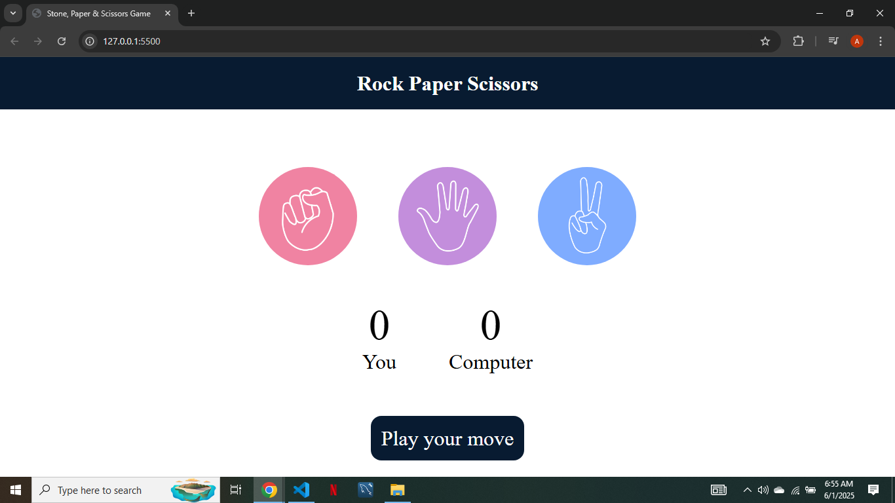

# ✊ Stone Paper Scissors Game

A fun and interactive **Stone Paper Scissors** game built using **HTML**, **CSS**, and **Vanilla JavaScript**. Play against the computer and see who wins!

## 🚀 Features

- Play against a computer opponent
- Randomized moves with fair logic
- Real-time score tracking
- Simple and clean interface

## 🛠️ Tech Stack

- HTML5  
- CSS3  
- JavaScript (Vanilla)

## 📸 Screenshot

 

## 🎯 Live Demo

Coming Soon via GitHub Pages...

## 👨‍💻 Author

**Sheikh Abubakr Faisal**  
[abubakrsheikh44@gmail.com](mailto:abubakrsheikh44@gmail.com)

## 📄 License

This project is for learning purposes only.
